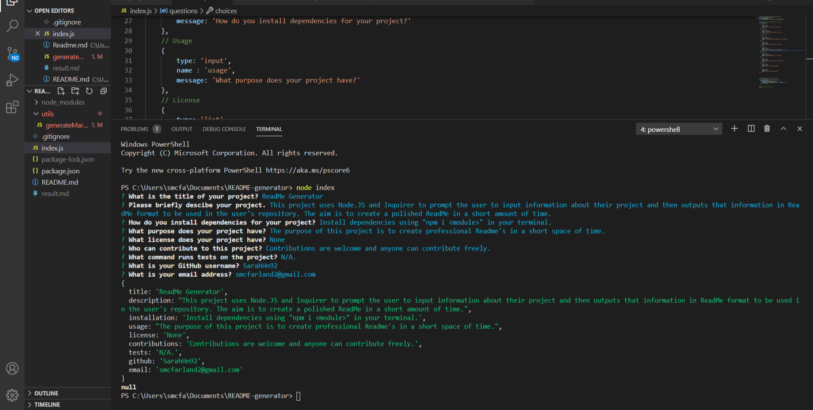

# README-generator

## Description
The aim of this project is to create basic, polished ReadMe's in a short time frame. They provide all the information required by the user. Using Node.JS, Inquirer, and FS, the ReadMe Generator prompts the user with a series of questions to provide information about their project. This is then output in standard ReadMe format with a licensing badge, table of contents, and contact information.

## Screenshot

## Project
Link to my repository: (https://github.com/SarahHn92/README-generator)
Link to example README (https://github.com/SarahHn92/README-generator/blob/main/example.md)